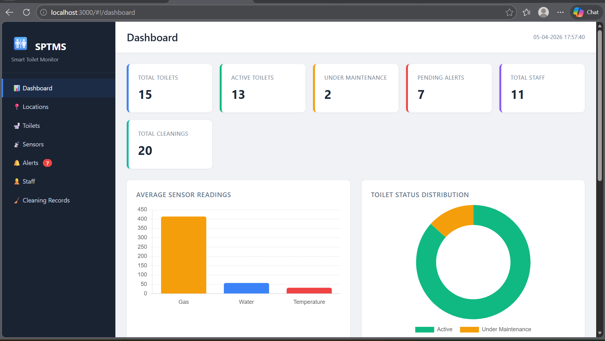
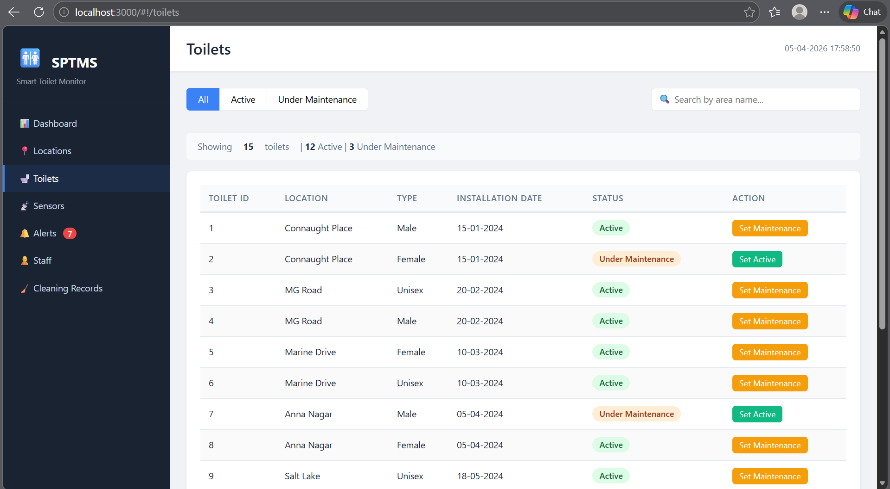
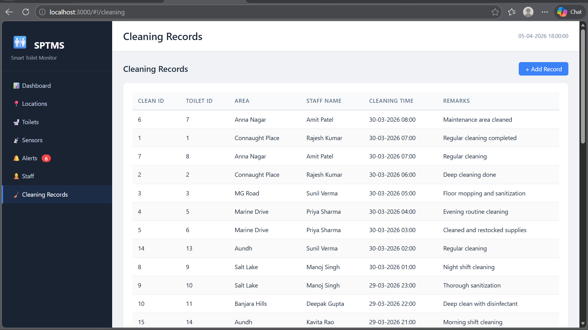
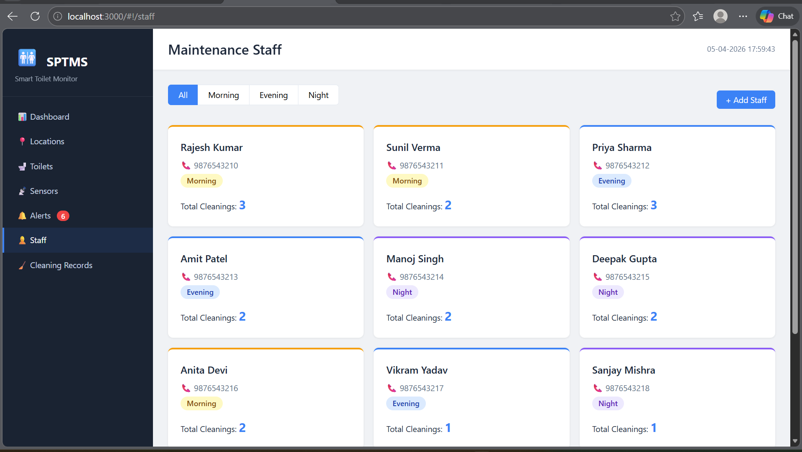
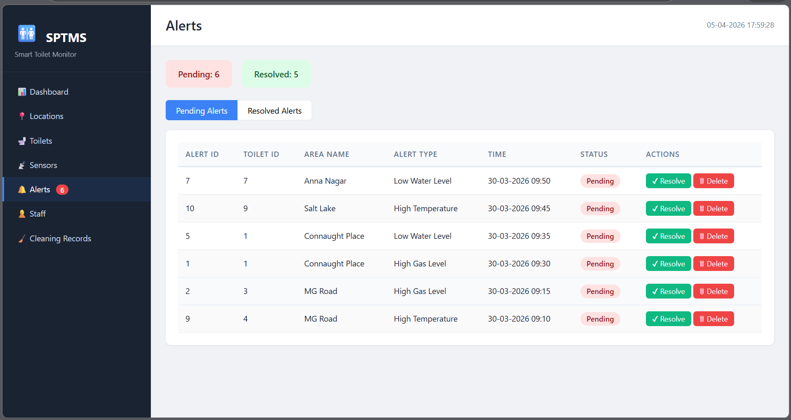
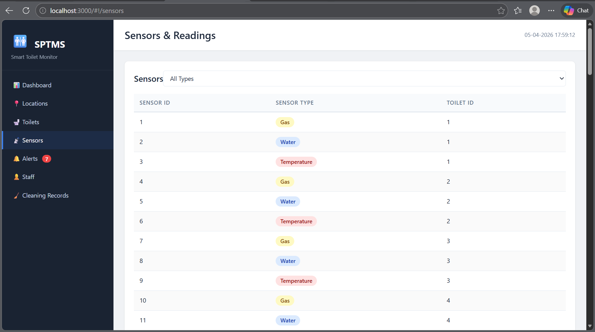
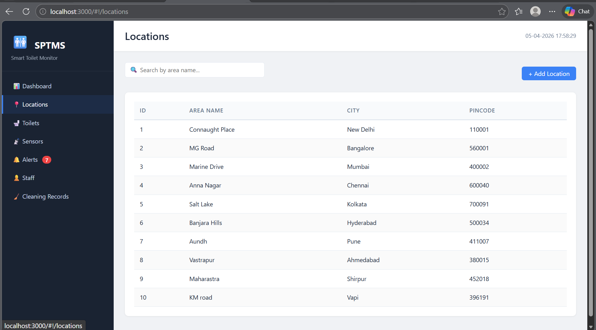

# 🚻 Smart Public Toilet Monitoring System (SPTMS)

## 📌 Project Overview

The **Smart Public Toilet Monitoring System (SPTMS)** is a web-based sanitation monitoring platform designed to improve the management and maintenance of public toilet facilities.

The system uses **simulated sensor data** to monitor toilet conditions, track cleaning activities, manage staff operations, and generate maintenance alerts through a centralized dashboard.

This project was collaboratively developed as part of a **DBMS and Web Programming academic project**.

---

## ✨ Features

* 🚻 Toilet status monitoring
* 📊 Dashboard for system monitoring
* 🧹 Cleaning and maintenance tracking
* 👨‍🔧 Staff management system
* 🚨 Alert generation for maintenance issues
* 📍 Location management
* 📈 Simulated sensor data monitoring
* 🗄️ Database-driven records management

---

## 🛠️ Tech Stack

### Frontend

* HTML
* CSS
* JavaScript

### Backend

* Node.js
* Express.js

### Database

* MySQL / SQL

---

## 📂 Project Structure

```bash
SPTMS/
│── backend/
│── frontend/
│── screenshots/
│── package.json
│── package-lock.json
│── setup_database.sql
│── sql_queries.txt
│── README.md
```

---

## ⚙️ Installation & Setup

### 1. Clone the repository

```bash
git clone https://github.com/aayushishirole06-tech/smart-public-toilet-monitoring-system.git
```

### 2. Install dependencies

```bash
npm install
```

### 3. Setup Database

Import `setup_database.sql` into MySQL.

### 4. Run the project

```bash
npm start
```

---

## 🎯 Future Scope

* Integration with real IoT sensors
* Real-time notifications
* Mobile application support
* GPS-based public toilet tracking
* Advanced analytics dashboard

---

## 📸 Project Screenshots

### Dashboard



### Toilet Monitoring



### Cleaning Records



### Staff Management



### Alerts



### Sensor Monitoring



### Location Management



---

## 👥 Team Members

* **Aayushi Shirole**
* **Pushp Jain**

Developed collaboratively as a **DBMS and Web Programming academic project**.

---

## 🔗 GitHub Profiles

**Aayushi Shirole**
https://github.com/aayushishirole06-tech

**Pushp Jain**
https://github.com/Pushp-Jain15
